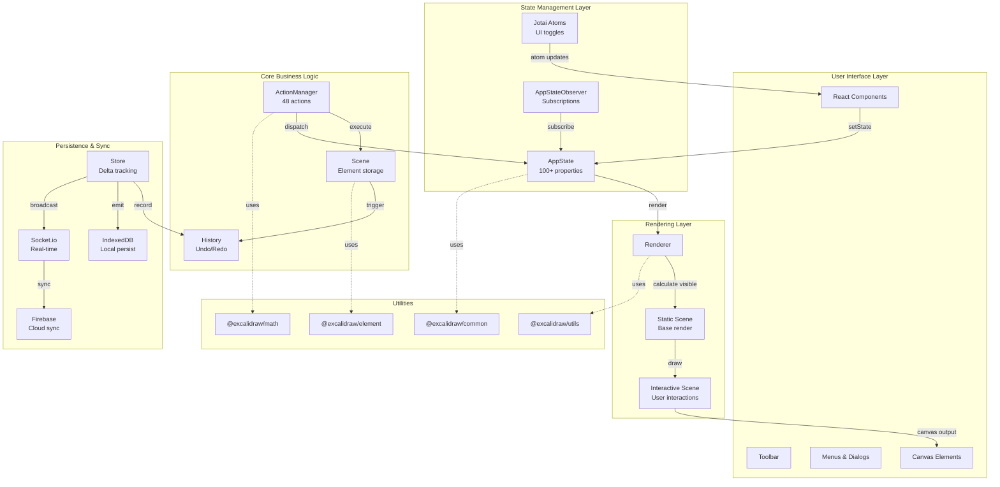
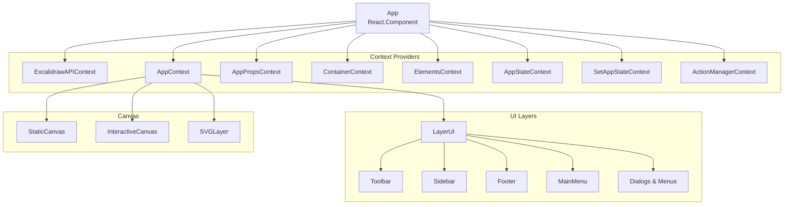
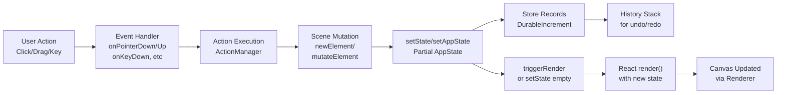
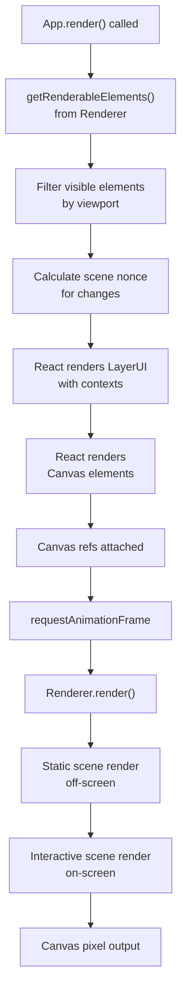

# Excalidraw Architecture

## High-level Architecture

### System Overview Diagram



### Component Hierarchy



---

## Data Flow

### User Interaction Flow



### State Propagation

```
AppState Change
    ↓
componentDidUpdate() called
    ↓
appStateObserver.flush(prevState)
    ↓
Notify all subscribed listeners
    ↓
Emitters trigger callbacks
    ├─ onChangeEmitter
    ├─ onScrollChangeEmitter
    ├─ onPointerDownEmitter
    └─ onPointerUpEmitter
    ↓
Child components receive via Context
    ↓
UI updates
```

### Real-time Collaboration Flow

```
Local Change
    ↓
Store emits Increment
    ├─ DurableIncrement → recorded to History
    └─ EphemeralIncrement → sent to peers
    ↓
Broadcasted via Socket.io
    ↓
Server receives & verifies
    ↓
Broadcast to other clients
    ↓
Remote receive
    ↓
applyDeltas() reconciliation
    ↓
Scene & AppState updated
    ↓
Bound elements refreshed
    ├─ Arrow bindings
    ├─ Text containers
    └─ Frame members
    ↓
UI re-renders
```

---

## State Management

### AppState Structure

AppState is a monolithic object containing 100+ properties organized by concern: viewport (scroll, zoom, size), tool state (active tool, locked), selection & editing (selected/hovered elements), element styling (colors, stroke, opacity), UI toggles (theme, view mode, dialogs), collaboration (remote users, follow state), and persistence (export options, file handle, name).

**See**: `packages/excalidraw/types.ts` for complete interface definition.

### App Class State Management

**Located in**: `packages/excalidraw/components/App.tsx`

The App class uses React state to store AppState. Key properties include scene (element storage), renderer (canvas rendering), actionManager (48 actions), library (drawable library), history (undo/redo), store (delta tracking), and api (public API). Uses `setAppState()` method and `triggerRender()` to manage updates and rendering triggers.

**See**: [`systemPatterns.md`](../memory/systemPatterns.md) for class component patterns.

### Jotai Atoms (UI-specific state)

Located in `editor-jotai.ts`, managed via `EditorJotaiProvider` with isolated store via `jotai-scope`. Examples: `isSidebarDockedAtom`, `activeEyeDropperAtom`, `searchItemInFocusAtom`, `libraryItemsAtom`, `chatHistoryAtom`, `errorAtom`. Atoms handle UI toggles, color picker, search focus, library state, and AI features.

### AppStateObserver Pattern

**Located in**: `packages/excalidraw/components/AppStateObserver.ts`

Enables flexible subscriptions to state changes via property key, property array, selector function, or predicate with callback or promise-based patterns. Allows components to subscribe to specific state changes without full AppState updates.

### ActionManager

**Located in**: `packages/excalidraw/actions/` (48 action files)

Manages all user actions (zoom, pan, reset, export, select, delete, duplicate, alignment, styling, undo/redo, groups, frames, etc.). Each action has name, label, keywords, perform function, predicate, and keyTest.

### Scene Management

**Located in**: `packages/excalidraw/scene/`

Stores elements separately from AppState. Provides methods for element access, selection, and updates. Elements tracked in Store for undo/redo and collaboration sync.

---

## Rendering Pipeline

### From React Component to Canvas



### Renderer Stages

**Located in**: `packages/excalidraw/scene/Renderer.ts` and `packages/excalidraw/renderer/`

Four main stages: **(1) Static Scene** renders base elements off-screen (shapes, text, styling). **(2) Interactive Scene** renders on-screen with user interactions (selection highlights, hover states, in-progress drawings). **(3) Snap Lines & Guides** optionally visualizes grid, alignment guides, and distance indicators. **(4) Animation Frame** handles smooth transitions, cursor trails, lasso, and eraser animations.

**Visibility flow**: Get non-deleted elements → filter by viewport bounds → include new/editing elements → sort by z-index → render via RoughJS.

---

## Package Dependencies

### Package Relationship Diagram

```mermaid
graph TB
    subgraph "@excalidraw/excalidraw (main)"
        App["App.tsx<br/>React component"]
        Actions["actions/<br/>48 action files"]
        Components["components/<br/>156 components"]
        Data["data/<br/>persistence & io"]
        Scene["scene/<br/>rendering"]
    end
    
    subgraph "@excalidraw/common"
        Const["constants.ts<br/>THEME, KEYS, etc"]
        Utils["utils.ts<br/>utility functions"]
        Colors["colors.ts<br/>color palette"]
        EditorInt["editorInterface.ts<br/>interface types"]
    end
    
    subgraph "@excalidraw/element"
        ETypes["types.ts<br/>ExcalidrawElement"]
        Binding["binding.ts<br/>arrow binding"]
        Bounds["bounds.ts<br/>element bounds"]
        Transform["transform.ts<br/>element transformation"]
        Collision["collision.ts<br/>hit detection"]
        Delta["delta.ts<br/>incremental changes"]
    end
    
    subgraph "@excalidraw/math"
        Point["point.ts<br/>Point operations"]
        Vector["vector.ts<br/>Vector math"]
        Curve["curve.ts<br/>Curve interpolation"]
        Ellipse["ellipse.ts<br/>Ellipse math"]
    end
    
    subgraph "@excalidraw/utils"
        Export["export.ts<br/>SVG/PNG export"]
        Shape["shape.ts<br/>shape utilities"]
        Bounds2["withinBounds.ts<br/>bounds checking"]
    end
    
    subgraph "External Dependencies"
        React["React 19.0"]
        Jotai["Jotai 2.11"]
        SocketIO["Socket.io 4.7"]
        Firebase["Firebase 11.3"]
        RoughJS["RoughJS 4.6.4"]
        PerfectFF["Perfect Freehand 1.2"]
    end
    
    App --> Actions
    App --> Components
    App --> Data
    App --> Scene
    Actions --> Const
    Components --> Const
    Data --> Const
    Scene --> Transform
    Actions --> ETypes
    Components --> ETypes
    Scene --> Delta
    Transform --> Vector
    Transform --> Point
    Binding --> Collision
    Bounds --> Point
    Export --> Shape
    
    App --> React
    App --> Jotai
    Data --> SocketIO
    Data --> Firebase
    Scene --> RoughJS
    Scene --> PerfectFF
    
    linkStyle 0,1,2,3,4,5,6,7,8,9,10,11,12,13,14,15,16 stroke:#2563eb,stroke-width:2px
    linkStyle 17,18,19,20,21,22 stroke:#16a34a,stroke-width:2px
```

### Dependency Overview

**External Dependencies**: React 19.0.0 (UI framework), TypeScript 5.9.3 (type safety), Vite 5.0.12 (build), Jotai 2.11.0 (UI state), Socket.io 4.7.2 (collaboration), Firebase 11.3.1 (cloud), RoughJS 4.6.4 (rendering), Perfect Freehand 1.2.0 (pen strokes).

**Internal Packages**: @excalidraw/common (constants, utilities, types) → @excalidraw/element (types, binding, bounds, collision, transform, delta) → @excalidraw/math (Point, Vector, Curve, Ellipse) → @excalidraw/utils (export, shape, bounds).

**Data Flow**: User → ActionManager → mutate ExcalidrawElement → apply transforms → Store → Socket.io → Firebase → export via Utils → Renderer (RoughJS) → Canvas.

**See**: `packages/excalidraw/package.json` for complete dependency versions and `docs/memory/techContext.md` for technology stack overview.

---

## Lifecycle Integration

### Full Request-Response Cycle

```
1. User draws on canvas
2. onPointerDown/Move/Up event handler fires
3. Event handler calls appropriate ActionManager action
4. Action calls scene.mutateElement() or modifies AppState
5. Store emits DurableIncrement (for history) and EphemeralIncrement (for sync)
6. setState() called with partial AppState
7. React schedules render
8. componentDidUpdate() called after render
9. appStateObserver.flush(prevState) notifies subscribers
10. Subscribers (emitters) trigger callbacks
11. Canvas re-renders via Renderer
12. triggerRender() possibly called for canvas-only update
13. Socket.io broadcasts changes to peers
14. Remote clients receive and apply deltas
15. Cycle repeats for each user action
```

### Performance Considerations

- **Selective rendering**: Only visible elements rendered
- **Canvas caching**: Shape cache prevents recalculation
- **Batched updates**: `withBatchedUpdates()` reduces renders
- **RAF throttling**: Animation frame throttled for 60 FPS
- **Memoization**: App.tsx wrapped in React.memo with custom comparison
- **Lazy evaluation**: Viewport calculation deferred until render

---

## 🔗 Related Documentation

**Learn more about:**
- **Memory Bank**: See [`docs/memory/`](../memory/) for foundational context:
  - [`projectbrief.md`](../memory/projectbrief.md) - Project goals and overview
  - [`systemPatterns.md`](../memory/systemPatterns.md) - Design patterns and principles
  - [`techContext.md`](../memory/techContext.md) - Technology stack details
  - [`decisionLog.md`](../memory/decisionLog.md) - Why these architectural choices were made
- **Product Requirements**: See [`docs/product/PRD.md`](../product/PRD.md) for feature requirements
- **Setup Guide**: See [`dev-setup.md`](dev-setup.md) for how to work with this architecture
- **Domain Glossary**: See [`docs/product/domain-glossary.md`](../product/domain-glossary.md) for term definitions
