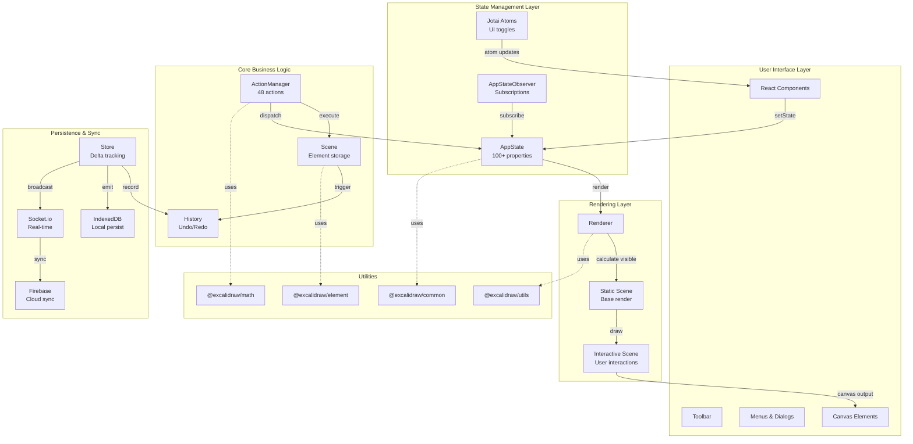
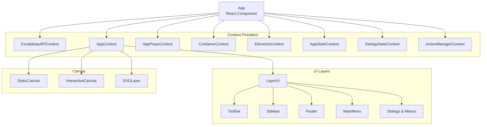
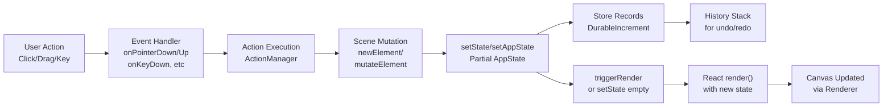
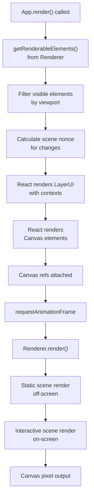

# Excalidraw Architecture

## High-level Architecture

### System Overview Diagram



### Component Hierarchy



---

## Data Flow

### User Interaction Flow



### State Propagation

```
AppState Change
    ↓
componentDidUpdate() called
    ↓
appStateObserver.flush(prevState)
    ↓
Notify all subscribed listeners
    ↓
Emitters trigger callbacks
    ├─ onChangeEmitter
    ├─ onScrollChangeEmitter
    ├─ onPointerDownEmitter
    └─ onPointerUpEmitter
    ↓
Child components receive via Context
    ↓
UI updates
```

### Real-time Collaboration Flow

```
Local Change
    ↓
Store emits Increment
    ├─ DurableIncrement → recorded to History
    └─ EphemeralIncrement → sent to peers
    ↓
Broadcasted via Socket.io
    ↓
Server receives & verifies
    ↓
Broadcast to other clients
    ↓
Remote receive
    ↓
applyDeltas() reconciliation
    ↓
Scene & AppState updated
    ↓
Bound elements refreshed
    ├─ Arrow bindings
    ├─ Text containers
    └─ Frame members
    ↓
UI re-renders
```

---

## State Management

### AppState Structure

AppState is a monolithic object containing 100+ properties organized by concern:

#### Viewport State
```typescript
scrollX: number              // Canvas viewport X position
scrollY: number              // Canvas viewport Y position
width: number                // Container width
height: number               // Container height
offsetLeft: number           // Container offset from window
offsetTop: number            // Container offset from window
zoom: { value: number }      // Zoom level (0.1 to 16)
```

#### Tool State
```typescript
activeTool: {
  type: 'selection' | 'rectangle' | 'diamond' | 'ellipse' | 
         'arrow' | 'line' | 'freedraw' | 'text' | 'eraser' | 'laser'
  customType: null | string
  locked: boolean            // Tool locked for repeated use
  fromSelection: boolean
  lastActiveTool: null | string
}
preferredSelectionTool: {
  type: string
  initialized: boolean
}
penMode: boolean             // Stylus/pen mode
penDetected: boolean         // Pen device detected
```

#### Selection & Editing
```typescript
selectedElementIds: Record<string, true>      // Currently selected
selectedGroupIds: Record<string, true>        // Selected groups
hoveredElementIds: Record<string, true>       // Hovered elements
editingTextElement: TextElement | null        // Currently editing
editingGroupId: string | null                 // Group being edited
newElement: Element | null                    // Being created
resizingElement: Element | null               // Being resized
selectedLinearElement: LinearElementEditor    // Arrow editor state
multiElement: Element[] | null                // Multi-point element
```

#### Element Styling
```typescript
currentItemStrokeColor: string
currentItemBackgroundColor: string
currentItemFillStyle: 'hachure' | 'cross-hatch' | 'solid'
currentItemStrokeStyle: 'solid' | 'dashed' | 'dotted'
currentItemStrokeWidth: number
currentItemOpacity: number
currentItemRoughness: 'architect' | 'artist' | 'cartoonist'
currentItemRoundness: 'round' | 'adaptive' | 'sharp'
currentItemFontFamily: number
currentItemFontSize: number
currentItemTextAlign: 'left' | 'center' | 'right'
```

#### UI State
```typescript
theme: 'light' | 'dark'
viewModeEnabled: boolean
zenModeEnabled: boolean
gridModeEnabled: boolean
openMenu: null | 'canvas' | 'shape'
openDialog: { name: string; tab?: string } | null
openPopup: { type: string } | null
openSidebar: { name: string; tab?: string } | null
contextMenu: { x: number; y: number } | null
showWelcomeScreen: boolean
showHyperlinkPopup: boolean
```

#### Collaboration
```typescript
collaborators: Map<SocketId, Collaborator>    // Remote users
userToFollow: Collaborator | null             // Following user
```

#### History & Persistence
```typescript
exportWithDarkMode: boolean
exportBackground: boolean
exportEmbedScene: boolean
exportScale: number
fileHandle: FileSystemFileHandle | null       // For file API
name: string | null                           // Drawing name
```

### App Class State Management

**Located in**: `packages/excalidraw/components/App.tsx` (lines 617-851)

```typescript
class App extends React.Component<AppProps, AppState> {
  // Class properties (not React state)
  canvas: HTMLCanvasElement
  scene: Scene                          // Element storage
  renderer: Renderer                    // Canvas rendering
  actionManager: ActionManager          // 48 actions
  library: Library                      // Drawable library
  history: History                      // Undo/redo
  store: Store                          // Delta tracking
  api: ExcalidrawImperativeAPI         // Public API
  
  // Initialization in constructor
  this.state = {
    ...defaultAppState,
    theme,
    width: window.innerWidth,
    height: window.innerHeight,
    // ... 100+ more properties
  }
  
  // Public state setter
  setAppState = (state: Partial<AppState>, callback?) => {
    this.setState(state, callback)
  }
  
  // Render trigger
  triggerRender = (force?: boolean) => {
    if (force) {
      this.scene.triggerUpdate()
    } else {
      this.setState({})  // Empty setState forces React update
    }
  }
}
```

### Jotai Atoms (UI-specific state)

Located in various components, managed via `editor-jotai.ts` (lines 1-18):

```typescript
// Sidebar toggle
export const isSidebarDockedAtom = atom(false)

// Color picker
export const activeEyeDropperAtom = atom<null | EyeDropperProperties>(null)

// Search menu
export const searchItemInFocusAtom = atom<number | null>(null)

// Library
export const libraryItemsAtom = atom<{...}>()
export const libraryItemSvgsCache = atom<SvgCache>(new Map())

// Dialogs
export const activeConfirmDialogAtom = atom<"clearCanvas" | null>(null)
export const overwriteConfirmStateAtom = atom<OverwriteConfirmState>({...})

// AI features (TTD)
export const chatHistoryAtom = atom<TChat.ChatHistory>({...})
export const savedChatsAtom = atom<SavedChats>([])
export const showPreviewAtom = atom<boolean>(false)
export const errorAtom = atom<Error | null>(null)
```

All atoms managed by `EditorJotaiProvider` with isolated store via `jotai-scope`.

### AppStateObserver Pattern

**Located in**: `packages/excalidraw/components/AppStateObserver.ts` (lines 1-209)

Enables flexible subscriptions to state changes:

```typescript
export type OnStateChange = {
  // Subscribe to single property
  <K extends keyof AppState>(
    prop: K,
    callback: (value: AppState[K], appState: AppState) => void
  ): UnsubscribeCallback
  
  // Subscribe to multiple properties
  (
    prop: (keyof AppState)[],
    callback: (appState: AppState) => void
  ): UnsubscribeCallback
  
  // Subscribe via selector function
  <T>(
    selector: (appState: AppState) => T,
    callback: (value: T, appState: AppState) => void
  ): UnsubscribeCallback
  
  // Subscribe via predicate
  (opts: {
    predicate: (appState: AppState) => boolean
    callback: (appState: AppState) => void
  }): UnsubscribeCallback
  
  // Promise-based (wait for change)
  <K extends keyof AppState>(prop: K): Promise<AppState[K]>
}
```

**Implementation**: `appStateObserver = new AppStateObserver(() => this.state)`

### ActionManager

**Located in**: `packages/excalidraw/actions/` (48 action files)

```typescript
class ActionManager {
  private actions = new Map<string, Action>()
  
  registerAction(action: Action): void
  registerAll(actions: Action[]): void
  executeAction(action: Action): void
}
```

**Action Structure**:
```typescript
interface Action {
  name: string
  label: string
  keywords: string[]
  perform: (elements, appState, value?, app?) => Partial<AppState>
  predicate: (appState, props?) => boolean
  keyTest: (event) => boolean
  registered: boolean
}
```

**48 Registered Actions** include:
- Canvas: zoom, pan, reset, export
- Selection: select all, deselect, invert
- Element: delete, duplicate, lock, hide
- Alignment: align left/right/top/bottom/center
- Distribution: distribute evenly
- Text: edit, convert to shape
- Styling: change colors, stroke, fill
- History: undo, redo
- Groups: group, ungroup
- Frames: create, manage
- And more...

### Scene Management

**Located in**: `packages/excalidraw/scene/` and `packages/element/src/Scene.ts`

```typescript
class Scene {
  private getNonDeletedElements(): ExcalidrawElement[]
  getElementsIncludingDeleted(): ExcalidrawElement[]
  getSelectedElements(appState: AppState): ExcalidrawElement[]
  getNonDeletedElementsMap(): Map<string, ExcalidrawElement>
  
  onUpdate(callback: () => void): () => void
  triggerUpdate(): void
  destroy(): void
}
```

**Element Storage**:
- Elements stored in `Store` (not AppState directly)
- Store tracks deltas for undo/redo
- Store emits increments for collaboration

---

## Rendering Pipeline

### From React Component to Canvas



### Renderer Stages

**Located in**: `packages/excalidraw/scene/Renderer.ts` and `packages/excalidraw/renderer/`

#### Stage 1: Static Scene (Base Elements)

```typescript
// File: interactiveScene.ts (13,752 tokens)
// Renders base elements off-screen
// Handles:
//   - Shape rendering (rectangles, ellipses, arrows)
//   - Text rendering
//   - Element styling (stroke, fill, opacity)
//   - Element transforms (position, rotation)
```

#### Stage 2: Interactive Scene (User Interactions)

```typescript
// File: interactiveScene.ts
// Renders on-screen interactive elements
// Handles:
//   - Selection highlights
//   - Hover states
//   - In-progress drawings
//   - Bound element indicators
//   - Collaboration cursors
```

#### Stage 3: Snap Lines & Guides

```typescript
// File: renderSnaps.ts (1,544 tokens)
// Optional visualization layer
// Renders:
//   - Grid lines (if gridModeEnabled)
//   - Snap guides (alignment, distribution)
//   - Distance indicators
```

#### Stage 4: Animation Frame

```typescript
// File: animation.ts (animation frame handling)
// Performs:
//   - Smooth transitions
//   - Cursor trails
//   - Lasso animations
//   - Eraser trails
```

### Viewport Calculation

**Located in**: `packages/excalidraw/scene/export.ts`

```typescript
getRenderableElements(config: {
  sceneNonce: string
  zoom: { value: number }
  offsetLeft: number
  offsetTop: number
  scrollX: number
  scrollY: number
  height: number
  width: number
  editingTextElement?: TextElement
  newElementId?: string
}): {
  elementsMap: Map<string, ExcalidrawElement>
  visibleElements: ExcalidrawElement[]
}
```

**Visibility Calculation**:
1. Get all non-deleted elements from scene
2. Filter by viewport bounds
3. Include newly created elements
4. Include elements in editing
5. Include frame contents
6. Sort by z-index

### Canvas Rendering

```typescript
// HTML5 Canvas API
const canvas = document.createElement("canvas")
const ctx = canvas.getContext("2d")

// RoughJS for hand-drawn style
const rc = rough.canvas(canvas)

// Draw flow:
//   1. Clear canvas
//   2. Set canvas size to device pixels
//   3. Apply scaling for zoom
//   4. For each visible element:
//       a. Translate to position
//       b. Rotate if needed
//       c. Draw shape via rc.rectangle/ellipse/etc
//       d. Draw text if applicable
//       e. Apply opacity
//   5. Draw UI overlays (selection, guides)
//   6. Request next animation frame
```

---

## Package Dependencies

### Package Relationship Diagram

```mermaid
graph TB
    subgraph "@excalidraw/excalidraw (main)"
        App["App.tsx<br/>React component"]
        Actions["actions/<br/>48 action files"]
        Components["components/<br/>156 components"]
        Data["data/<br/>persistence & io"]
        Scene["scene/<br/>rendering"]
    end
    
    subgraph "@excalidraw/common"
        Const["constants.ts<br/>THEME, KEYS, etc"]
        Utils["utils.ts<br/>utility functions"]
        Colors["colors.ts<br/>color palette"]
        EditorInt["editorInterface.ts<br/>interface types"]
    end
    
    subgraph "@excalidraw/element"
        ETypes["types.ts<br/>ExcalidrawElement"]
        Binding["binding.ts<br/>arrow binding"]
        Bounds["bounds.ts<br/>element bounds"]
        Transform["transform.ts<br/>element transformation"]
        Collision["collision.ts<br/>hit detection"]
        Delta["delta.ts<br/>incremental changes"]
    end
    
    subgraph "@excalidraw/math"
        Point["point.ts<br/>Point operations"]
        Vector["vector.ts<br/>Vector math"]
        Curve["curve.ts<br/>Curve interpolation"]
        Ellipse["ellipse.ts<br/>Ellipse math"]
    end
    
    subgraph "@excalidraw/utils"
        Export["export.ts<br/>SVG/PNG export"]
        Shape["shape.ts<br/>shape utilities"]
        Bounds2["withinBounds.ts<br/>bounds checking"]
    end
    
    subgraph "External Dependencies"
        React["React 19.0"]
        Jotai["Jotai 2.11"]
        SocketIO["Socket.io 4.7"]
        Firebase["Firebase 11.3"]
        RoughJS["RoughJS 4.6.4"]
        PerfectFF["Perfect Freehand 1.2"]
    end
    
    App --> Actions
    App --> Components
    App --> Data
    App --> Scene
    Actions --> Const
    Components --> Const
    Data --> Const
    Scene --> Transform
    Actions --> ETypes
    Components --> ETypes
    Scene --> Delta
    Transform --> Vector
    Transform --> Point
    Binding --> Collision
    Bounds --> Point
    Export --> Shape
    
    App --> React
    App --> Jotai
    Data --> SocketIO
    Data --> Firebase
    Scene --> RoughJS
    Scene --> PerfectFF
    
    linkStyle 0,1,2,3,4,5,6,7,8,9,10,11,12,13,14,15,16 stroke:#2563eb,stroke-width:2px
    linkStyle 17,18,19,20,21,22 stroke:#16a34a,stroke-width:2px
```

### Dependency Flow

#### External Dependencies

**React 19.0.0**
- Used in: All components (App.tsx, 156 components)
- Purpose: UI framework, hooks, context
- Export: Components returned as JSX

**TypeScript 5.9.3**
- Used in: All source files
- Purpose: Type safety (strict mode enabled)
- Exports: Type definitions

**Vite 5.0.12**
- Used in: Build system
- Purpose: Bundle and serve ESM
- Outputs: `dist/prod/index.js`, `dist/dev/index.js`, CSS

**Jotai 2.11.0**
- Used in: UI state management
- Atoms: Dialog toggles, sidebar state, search focus, library items
- Provider: EditorJotaiProvider with jotai-scope

**Socket.io-client 4.7.2**
- Used in: Real-time collaboration
- Emits: Element updates, user presence
- Listens: Remote changes, collaborator updates

**Firebase 11.3.1**
- Used in: Cloud persistence
- Services: Firestore (documents), Storage (files), Auth
- Integration: `excalidraw-app/data/firebase.ts`

**RoughJS 4.6.4**
- Used in: Canvas rendering
- Purpose: Hand-drawn style rendering
- Called in: `renderer/interactiveScene.ts`

**Perfect Freehand 1.2.0**
- Used in: Freehand drawing
- Purpose: Smooth curve interpolation
- Applies to: Pen tool strokes

#### Internal Package Dependencies

**@excalidraw/excalidraw imports from:**
```
├── @excalidraw/common
│   ├── constants (THEME, KEYS, COLOR_PALETTE)
│   ├── utils (coordinate conversions)
│   └── types (EditorInterface, utility types)
├── @excalidraw/element
│   ├── types (ExcalidrawElement, all element types)
│   ├── binding (arrow binding logic)
│   ├── transform (element mutations)
│   ├── collision (hit detection)
│   └── delta (incremental changes for undo/redo)
├── @excalidraw/math
│   ├── Point operations
│   ├── Vector math (rotation, scaling)
│   ├── Curve interpolation
│   └── Ellipse calculations
└── @excalidraw/utils
    ├── Export utilities (SVG, PNG, Canvas)
    ├── Shape utilities
    └── Bounds checking
```

### Data Flow Through Packages

```
User Input (App.tsx)
    ↓
ActionManager (actions/)
    ↓ mutates
ExcalidrawElement (@excalidraw/element)
    ↓ uses math for transforms
@excalidraw/math
    ↓ uses constants and types
@excalidraw/common
    ↓ stores and tracks deltas
Store (data/store.ts)
    ↓ broadcasts via Socket.io
Firebase (persistence)
    ↓ exports via
@excalidraw/utils (export.ts)
    ↓ renders via
Renderer (scene/)
    ↓ uses RoughJS for styling
Canvas Output
```

### Package Separation Rationale

| Package | Purpose | When Used | Bundle Impact |
|---------|---------|-----------|----------------|
| @excalidraw/excalidraw | Full editor component | All embedding scenarios | 420 KB (prod) |
| @excalidraw/common | Constants & utilities | Always (imported by all) | Minimal |
| @excalidraw/element | Element types & operations | Element manipulation | ~15% of bundle |
| @excalidraw/math | Mathematical utilities | Rendering & transforms | ~5% of bundle |
| @excalidraw/utils | Export functions | Export operations only | ~10% of bundle |

---

## Lifecycle Integration

### Full Request-Response Cycle

```
1. User draws on canvas
2. onPointerDown/Move/Up event handler fires
3. Event handler calls appropriate ActionManager action
4. Action calls scene.mutateElement() or modifies AppState
5. Store emits DurableIncrement (for history) and EphemeralIncrement (for sync)
6. setState() called with partial AppState
7. React schedules render
8. componentDidUpdate() called after render
9. appStateObserver.flush(prevState) notifies subscribers
10. Subscribers (emitters) trigger callbacks
11. Canvas re-renders via Renderer
12. triggerRender() possibly called for canvas-only update
13. Socket.io broadcasts changes to peers
14. Remote clients receive and apply deltas
15. Cycle repeats for each user action
```

### Performance Considerations

- **Selective rendering**: Only visible elements rendered
- **Canvas caching**: Shape cache prevents recalculation
- **Batched updates**: `withBatchedUpdates()` reduces renders
- **RAF throttling**: Animation frame throttled for 60 FPS
- **Memoization**: App.tsx wrapped in React.memo with custom comparison
- **Lazy evaluation**: Viewport calculation deferred until render

---

## 🔗 Related Documentation

**Learn more about:**
- **Memory Bank**: See [`docs/memory/`](../memory/) for foundational context:
  - [`projectbrief.md`](../memory/projectbrief.md) - Project goals and overview
  - [`systemPatterns.md`](../memory/systemPatterns.md) - Design patterns and principles
  - [`techContext.md`](../memory/techContext.md) - Technology stack details
  - [`decisionLog.md`](../memory/decisionLog.md) - Why these architectural choices were made
- **Product Requirements**: See [`docs/product/PRD.md`](../product/PRD.md) for feature requirements
- **Setup Guide**: See [`dev-setup.md`](dev-setup.md) for how to work with this architecture
- **Domain Glossary**: See [`docs/product/domain-glossary.md`](../product/domain-glossary.md) for term definitions